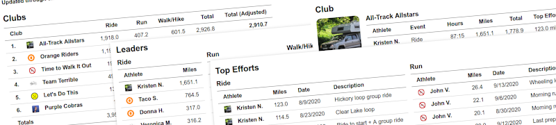

# 🚴‍♂️ Strava Club Tracker

Un tracker personalizado para analizar el progreso de clubes de Strava y generar dashboards detallados.



## ✨ Características

- 📊 **Dashboard completo** con estadísticas del club
- 🏆 **Rankings de atletas** por actividad
- 📈 **Totales por deporte** (ciclismo, running, natación, etc.)
- 👥 **Páginas individuales** de cada atleta
- 📄 **Exportación CSV** de todos los datos
- 🔧 **Reglas personalizables** para diferentes deportes
- 🔐 **Autenticación OAuth** completa con Strava

## 🚀 Instalación

### Requisitos
- PHP 8.0 o superior
- Composer
- Cuenta de desarrollador en Strava

### Configuración

1. **Clona el repositorio:**
   ```bash
   git clone https://github.com/TU_USUARIO/strava-club-tracker.git
   cd strava-club-tracker
   ```

2. **Instala las dependencias:**
   ```bash
   cd lib
   composer install
   ```

3. **Inicia el servidor local:**
   ```bash
   cd htdocs
   php -S 127.0.0.1:8000
   ```

4. **Configura tu aplicación de Strava:**
   - Ve a: https://www.strava.com/settings/api
   - Crea una nueva aplicación
   - Configura el callback: `http://127.0.0.1:8000/oauth_strava.php`

5. **Accede al proyecto:**
   ```
   http://127.0.0.1:8000/
   ```

## 📋 Uso

### 1. Configurar OAuth
- Ve a `http://127.0.0.1:8000/oauth_strava.php`
- Ingresa tu Client ID y Client Secret
- Autoriza la aplicación con Strava

### 2. Descargar datos
- Accede a `http://127.0.0.1:8000/strava_downloader.php`
- Los datos se descargarán automáticamente

### 3. Generar reportes
- Ve a `http://127.0.0.1:8000/generate_reports.php`
- Se generarán dashboards HTML

### 4. Ver resultados
- Dashboard principal: `http://127.0.0.1:8000/index.html`
- Páginas individuales de atletas
- Exportación CSV disponible

## ⚙️ Configuración

### Club ID
Edita `htdocs/strava_downloader.php` y configura tu Club ID:
```php
$clubs = array(
    325418,  // Tu Club ID de Strava
);
```

### Deportes y reglas
Personaliza las reglas en `htdocs/generate_reports.php`:
```php
$tracker->setSport('Ride', array('distanceMultiplier' => 0.25));
$tracker->setSport('Run',  array('maxSpeed' => 15.0));
$tracker->setSport('Walk', array('label' => 'Walk/Hike', 'maxSpeed' => 8.0));
```

### Fechas
Ajusta el período de análisis en `strava_downloader.php`:
```php
$startDate = '2024-08-01';
$endDate   = '2024-08-14';
```

## 🛠️ Herramientas incluidas

- **OAuth Strava** (`oauth_strava.php`) - Configuración OAuth completa
- **Descargador** (`strava_downloader.php`) - Descarga datos de clubes
- **Generador** (`generate_reports.php`) - Crea reportes HTML
- **Diagnóstico** (`debug_token.php`) - Herramientas de debugging

## 📊 Estructura del proyecto

```
strava-club-tracker/
├── htdocs/              # Archivos web públicos
│   ├── index.php        # Página principal
│   ├── oauth_strava.php # Configuración OAuth
│   ├── strava_downloader.php # Descargador de datos
│   └── generate_reports.php  # Generador de reportes
├── lib/                 # Librerías y dependencias
│   ├── vendor/          # Dependencias de Composer
│   └── template/        # Plantillas HTML
├── json/               # Datos descargados (ignorado en Git)
└── README.md
```

## 🔐 Seguridad

- Los tokens de acceso no se incluyen en el repositorio
- Los datos descargados se ignoran en Git por privacidad
- Usa HTTPS en producción
- Revisa los permisos de tu aplicación de Strava

## 📝 Licencia

Este proyecto está basado en [StravaClubTracker](https://github.com/picasticks/StravaClubTracker) bajo licencia GPL-3.0.

## 🤝 Contribuir

1. Fork el proyecto
2. Crea una rama para tu feature (`git checkout -b feature/nueva-funcionalidad`)
3. Commit tus cambios (`git commit -am 'Agrega nueva funcionalidad'`)
4. Push a la rama (`git push origin feature/nueva-funcionalidad`)
5. Abre un Pull Request

## 📞 Soporte

Si tienes problemas:
1. Revisa la [documentación de Strava API](https://developers.strava.com/docs/)
2. Usa las herramientas de diagnóstico incluidas
3. Abre un issue en GitHub

---

**¡Disfruta analizando los datos de tu club de Strava!** 🚴‍♂️📊
